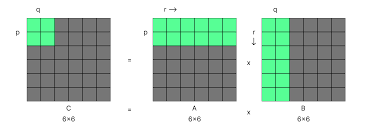
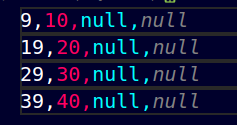

# Matrix Block Partitioning System

## Problem Statement
Given a large square matrix that exceeds memory constraints, implement a system to:
1. Read and process the matrix in blocks of maximum Given BYTES_PER_BLOCK
2. Store these blocks efficiently
3. Allow retrieval of specific blocks
4. Manage multiple matrices through a catalogue system

## Key Challenges & Solutions

### 1. Block-wise Matrix Reading
**Challenge**: Reading matrix data within memory constraints (1KB blocks)

**Solution**:
- Matrix is partitioned into square blocks
- Block size calculated based on memory limit and size of integers
- Each block is processed and stored independently

<!--  -->


*Fig 1: Green represents current block being processed, grey is the full matrix*

Example for a 5x5 matrix with 2×2 blocks:
```
Original Matrix:     
1  2  3  4  5    
7  8  9  10 11   
13 14 15 16 17   
19 20 21 22 23 
25 26 27 28 29 
31 32 33 34 35 
```

```
Block_0_1.csv:
3  4
9  10
```


### 2. Padding & Boundaries
**Challenge**: Handling incomplete blocks at matrix boundaries

**Solution**:
- Used MAX_INT as padding (stored as "null" in files)
- Ensures consistent block sizes
- Distinguishable from valid integer data


From previous Matrix 
```
Block_0_2.csv:
5  null
11  null
```





### 3. Memory-Efficient Reading
**Challenge**: Initial implementation read entire rows, exceeding memory limits

**Solution**:
- Implemented precise file positioning
- Read only required elements for current block
- Skip unwanted elements efficiently

### 4. Matrix Management
**Challenge**: Managing multiple matrices and their block files

**Solution**:
- Implemented MatrixCatalogue for centralized management
- Automatic cleanup of block files
- Consistent interface similar to TableCatalogue

## Implementation Structure

### File Organization
```
matrix_name_row_col.csv
Example: matrix1_0_1.csv (block at row 0, column 1)
```

### Key Classes
1. **Matrix**
   - Handles partitioning
   - Block reading/writing
   - Memory management

2. **MatrixCatalogue**
   - Matrix registration
   - Resource management
   - Block file cleanup


## Block Size Calculation Logic

### Memory Constraints
- BLOCK_SIZE_KB = 1KB (1024 bytes)
- Integer size = 4 bytes

### Calculation Flow
1. Maximum integers possible in 1KB = 1024/4 = 256 integers
2. Since block must be square: blockSize = floor(sqrt(256)) = 16
3. For N×N matrix: required blocks = ceil(N/16) in each row and column

### Result
- Each block is 16×16 integers
- Uses exactly 1KB memory (16×16×4 = 1024 bytes)
- Remaining space in last blocks is padded with null values

---
Note: Code implementation details can be found in `matrix.h`, `matrix.cpp`, `matrixCatalogue.h`, and `matrixCatalogue.cpp`.